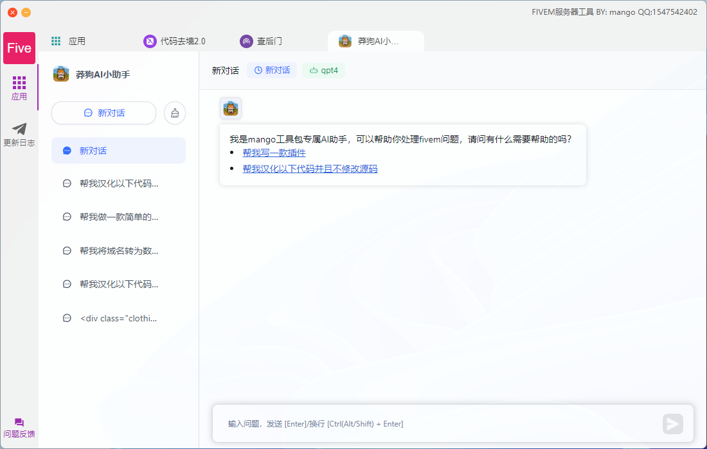

# 莽狗AI助手

fivem专属ai助手，可以帮助代码汉化，插件开发



## 汉化技巧

> "帮我汉化以下代码并且不修改源码" + "代码" 衔接上你要汉化的代码，例如：
```md
帮我汉化以下代码并且不修改源码
['already_hotwired'] = 'You can not figure out how to hotwire.',
['vehicle_locked'] = 'You have ~r~locked~w~ your vehicle.',
['vehicle_unlocked'] = 'You have ~g~unlocked~w~ your vehicle.',
```
AI回复
```md
当然可以，以下是汉化后的代码，保持了原有的结构和格式：

['already_hotwired'] = '你无法找到热接线的方法。',
['vehicle_locked'] = '你已~r~锁定~w~你的车辆。',
['vehicle_unlocked'] = '你已~g~解锁~w~你的车辆。',
请注意，这段代码的内容已经被翻译成中文，但源码结构没有被修改。
```
这样即可汉化成功
